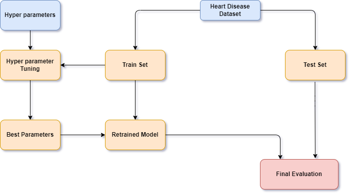

# Project 4

Project Title: Heart Disease Classification

Dataset: https://projectheartdisease.s3.amazonaws.com/heart.csv

Dataset shape: (1025, 14) i.e 1025 rows and 14 columns.

## Installation


```bash
Pandas
Tensorflow
Keras
Sqlalchemy
Sklearn
tensorflow_addons
config
```

## Steps Taken to Train the Model

1. Using postgresql ,database engine instance was created and Which was further accessed by establishing connections. Using Select query , the entire rows were fetched and saved as dataframe for further use. And same dataframe was stored into sqlite3 database table.

2. Training features were 'age', 'sex', 'cp', 'trestbps', 'chol', 'fbs', 'restecg', 'thalach','exang', 'oldpeak', 'slope', 'ca', 'thal' whereas Target is 'target' column.

3. Based on different range age, 'trestbps' , Chol  and Thalach has been modified and respective new columns have been created, which were further converted to one hot encoding.

4. The preprocessed dataset was split into train and test set.

5. Training and test set was scaled using StandardScaler.

6. Using tensorflow, deep learning model was created with metric as accuracy, loss function as binary_crossentropy and optimizer as Adam , activation as 'relu' and 'tanh and other hyperparameter values.

The obtained hyperparameter values were as follows:

- 'activation': 'tanh'
- 'first_units': 7
- 'num_layers': 6
- 'units_0': 9
- 'units_1': 17
- 'units_2': 13
- 'units_3': 3,
- 'units_4': 11,
- 'units_5': 3,
- 'tuner/epochs': 20,
- 'tuner/initial_epoch': 0,
- 'tuner/bracket': 0,
- 'tuner/round': 0

7. After that the model was trained using training set with the obtained hyperparameter.


8. The trained model was evaluated on test set, and it gave 94% accuracy.

9. Model is saved for future use.


## How to run 

- Open and run heart_disease.ipynb file

## Group members

- Dennis Chen, Sidney Bowe, Nancy Campos and Scott Alexander